# Especificação do Design System do Notes App

> **Status**: Referência Autoritativa  
> **Origem**: Sincronizado diretamente com [`DESIGN.md`](../../../../DESIGN.md)  
> **Arquitetura**: Grafo de Conhecimento Local-First & Object Studio  
> **Direção Visual**: Minimalismo Editorial, Santuário Monástico de Conhecimento, Paridade com Capacities  
> **Stack de UI**: Next.js 16 (App Router), React 19, Tailwind CSS v4, Primitivas Base UI, Editor Rich-Text Plate  

---

## 1. Identidade do Produto & Filosofia de Design

A identidade visual e a experiência de produto do Notes App fundamentam-se nos princípios de um **santuário monástico de conhecimento editorial**—um estúdio digital contemplativo e de alta precisão projetado para foco profundo, síntese estruturada e composição contínua de conhecimento.

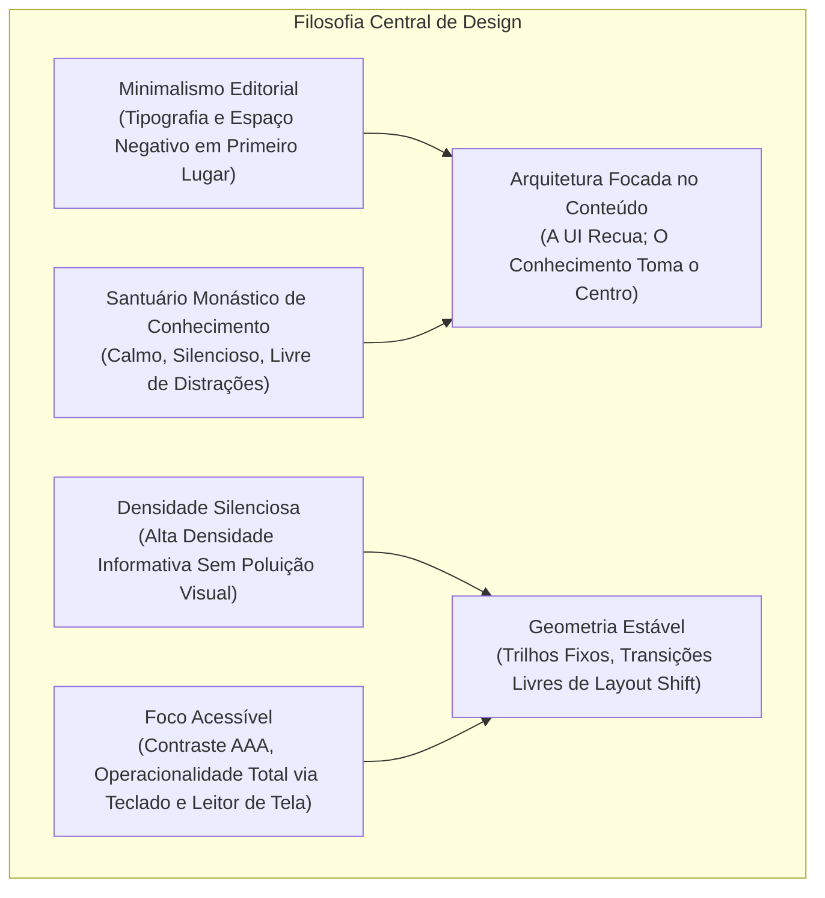

### Pilares Fundamentais

1. **Minimalismo Editorial**: A tipografia e o espaço negativo são tratados como elementos estruturais primários, não como mera decoração. Os layouts evocam a sobriedade e a clareza de publicações editoriais sob medida.
2. **Santuário Monástico de Conhecimento**: A interface oferece um ambiente sereno e privado, livre de badges de gamificação barulhentos, banners promocionais pulsantes ou barras de widgets caóticas. Cada elemento visual justifica sua presença por necessidade funcional.
3. **Apresentação Focada no Conteúdo**: Molduras, trilhos de navegação e painéis de propriedades recuam suavemente para o segundo plano, elevando as notas, relações entre objetos e sínteses multimídia do usuário à proeminência principal.
4. **Densidade Silenciosa**: A hierarquia visual otimiza a densidade informativa sem causar congestão visual. Controles compactos, escalas tipográficas sutis e cartões modulares garantem que grandes grafos de conhecimento possam ser inspecionados confortavelmente à primeira vista.
5. **Geometria Estável & Transições Livres de Layout Shift**: Larguras de painéis, calhas e trilhos de layout aderem a métricas matemáticas estritas. Sanfonas, gavetas e transições modais utilizam transformações aceleradas por hardware (`transform`, `opacity`) para eliminar mudanças inesperadas de layout (CLS = 0).
6. **Foco Acessível & Ergonomia Inclusiva**: Conformidade estrita com as razões de contraste de texto WCAG 2.2 AAA e contraste de controles não-textuais AA. Todos os componentes interativos mantêm anéis de foco distintos (`outline-ring/50`) e ciclos completos de navegação por teclado.

---

## 2. Paleta de Cores Semântica & Arquitetura OKLCH

O sistema de design utiliza o modelo de cores **OKLCH** (Luminosidade, Croma, Matiz) para garantir uniformidade perceptiva, curvas de contraste consistentes entre diferentes matizes e transições previsíveis para o modo escuro.

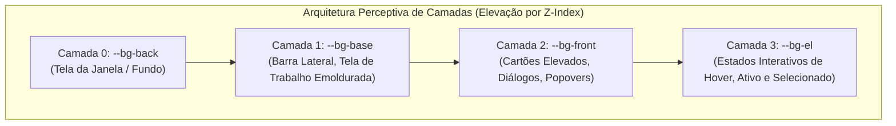

### Tokens Semânticos de Superfície & Fundo

| Variável CSS | Modo Claro (OKLCH) | Modo Escuro (OKLCH) | Função Semântica |
| :--- | :--- | :--- | :--- |
| `--bg-back` | `oklch(0.9856 0.0016 67)` | `oklch(0.1605 0.0063 285.63)` | Fundo geral da aplicação, calha em torno das janelas flutuantes. |
| `--bg-base` | `oklch(1 0.0001 263.28)` | `oklch(0.1971 0.006 285.78)` | Superfície principal de trabalho, corpo do editor, fundo da barra lateral. |
| `--bg-front` | `oklch(1 0.0001 263.28)` | `oklch(0.2191 0.0058 285.84)` | Superfícies elevadas, hover cards, menus dropdown, diálogos modais, painéis inspetores. |
| `--bg-el` | `oklch(0.9676 0.0016 67.02)` | `oklch(0.2987 0.0072 285.88)` | Linhas de lista selecionadas, abas ativas, fundos sutis de cartão, base de badges. |
| `--bg-el-hover` | `oklch(0.9406 0.0016 67.05)` | `oklch(0.3226 0.007 285.92)` | Overlay efêmero de hover ao passar o ponteiro em itens interativos e botões. |
| `--bg-el-active` | `oklch(0.9163 0.0017 67.07)` | `oklch(0.3688 0.0051 286.01)` | Estado pressionado para botões, seleções ativas de navegação. |
| `--bg-el-strong` | `oklch(0.9163 0.0017 67.07)` | `oklch(0.3688 0.0051 286.01)` | Estado selecionado forte e ênfase em controles compactos. |

### Tokens de Borda & Divisor

| Variável CSS | Modo Claro (OKLCH) | Modo Escuro (OKLCH) | Função Semântica |
| :--- | :--- | :--- | :--- |
| `--border-base` | `oklch(0.9163 0.0017 67.07)` | `oklch(0.2987 0.0072 285.88)` | Bordas estruturais padrão, perímetro de cartões, divisores de painel. |
| `--border-front` | `oklch(0.9163 0.0017 67.07)` | `oklch(0.2987 0.0072 285.88)` | Borda fina estilo Capacities para popovers, cartões de pré-visualização e superfícies frontais. |
| `--border-base-strong` | `oklch(0.8643 0.0017 67.13)` | `oklch(0.3461 0.0069 285.94)` | Contornos de controle mais fortes e divisores enfatizados. |
| `--border-subtle` | `oklch(0.000 0 0 / 6%)` | `oklch(1.000 0 0 / 8%)` | Divisores de lista ultra-finos, bordas de linha de tabela, limites de blocos aninhados. |
| `--border-strong` / `--ring` | `oklch(0.7161 0.006 30.59)` | `oklch(0.8643 0.0017 67.13)` | Bordas de alta ênfase, contornos de seleção ativa, células de tabela selecionadas e anéis de foco por teclado. |

### Tokens de Tinta & Tipografia

| Variável CSS | Modo Claro (OKLCH) | Modo Escuro (OKLCH) | Razão de Contraste | Função Semântica |
| :--- | :--- | :--- | :--- | :--- |
| `--text-primary` | `oklch(0.2191 0.0058 285.84)` | `oklch(1 0.0001 263.28)` | AA+ | Títulos de documentos, corpo de texto principal, rótulos de título ativo. |
| `--text-secondary` | `oklch(0.3887 0.0052 301.05)` | `oklch(0.9163 0.0017 67.07)` | AA+ | Descrições secundárias, marcas temporais, chaves de propriedade, badges de metadados e tinta de ação `--primary` do shadcn. |
| `--text-subtle` | `oklch(0.5725 0.0051 33.89)` | `oklch(0.7161 0.006 30.59)` | AA | Texto de placeholder, controles desabilitados, separadores de breadcrumb, dicas de atalho. |
| `--text-inverse` | `oklch(0.985 0 0)` | `oklch(0.145 0 0)` | ~14.5:1 (AAA) | Rótulos de botão de alto contraste, texto de badge invertido, texto de tooltip sólido. |

### Contrato de Aliases em Runtime

`src/app/globals.css` expõe a paleta de paridade Capacities tanto por tokens compatíveis com shadcn (`--background`, `--foreground`, `--card`, `--popover`, `--primary`, `--border`, `--input`, `--ring`) quanto por aliases específicos do app (`--app-bg-*`, `--app-border-*`, `--app-text-*`, `--app-shadow-*`). Os componentes devem consumir esses aliases em vez de duplicar valores OKLCH literais.

O token `--primary` do shadcn utiliza intencionalmente a tinta de ação medida do Capacities (`oklch(0.3887 0.0052 301.05)` no modo claro) em vez de uma cor de marca saturada. Azul, vermelho, verde, âmbar e violeta permanecem como pistas semânticas para foco, ações destrutivas, status, avisos e relações.

---

## 3. Sistema de 18 Tons Semânticos Capacities

A aplicação adota a **Paleta completa de 18 Tons Capacities** para alimentar a identidade visual de tipos de objetos, tags de taxonomia, pílulas de status e categorias de nós do grafo. Cada tom fornece fórmulas calibradas de texto, fundo e borda para manter a legibilidade nos modos claro e escuro.

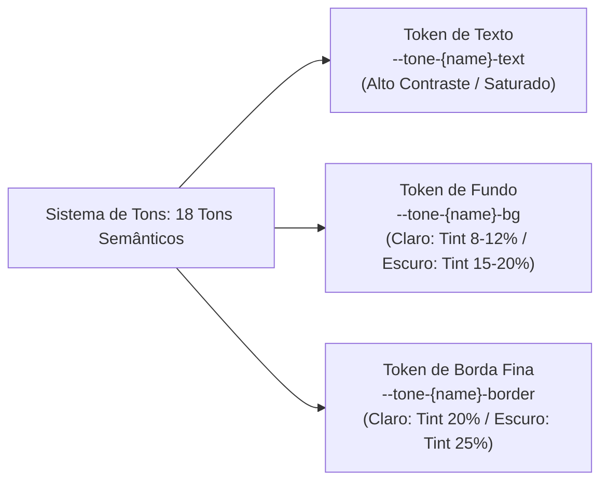

### Especificação Completa dos 18 Tokens de Tom

| Nome do Tom | Texto Claro (OKLCH) | Fundo Claro (OKLCH) | Texto Escuro (OKLCH) | Fundo Escuro (OKLCH) | Mapeamento Padrão de Objetos |
| :--- | :--- | :--- | :--- | :--- | :--- |
| **Amber** | `oklch(0.55 0.16 75)` | `oklch(0.96 0.04 75)` | `oklch(0.82 0.14 75)` | `oklch(0.28 0.08 75)` | `atomic-note`, `idea`, callouts de `warning` |
| **Blue** | `oklch(0.48 0.18 250)` | `oklch(0.95 0.04 250)` | `oklch(0.78 0.15 250)` | `oklch(0.26 0.08 250)` | `area`, `weblink`, callouts de `info` |
| **Cyan** | `oklch(0.50 0.14 210)` | `oklch(0.95 0.03 210)` | `oklch(0.80 0.13 210)` | `oklch(0.26 0.07 210)` | `media`, `audio`, transcrições |
| **Emerald** | `oklch(0.48 0.16 155)` | `oklch(0.95 0.04 155)` | `oklch(0.80 0.14 155)` | `oklch(0.26 0.07 155)` | `project`, `place`, status ativo |
| **Fuchsia** | `oklch(0.50 0.22 320)` | `oklch(0.95 0.05 320)` | `oklch(0.80 0.18 320)` | `oklch(0.27 0.10 320)` | `ai-chat`, prompt criativo, síntese |
| **Gray** | `oklch(0.45 0.02 260)` | `oklch(0.94 0.01 260)` | `oklch(0.75 0.02 260)` | `oklch(0.25 0.01 260)` | `file`, `archive`, padrão do sistema |
| **Green** | `oklch(0.46 0.17 140)` | `oklch(0.95 0.04 140)` | `oklch(0.78 0.15 140)` | `oklch(0.26 0.08 140)` | `task (concluída)`, callout de `success`, verificado |
| **Indigo** | `oklch(0.45 0.20 275)` | `oklch(0.95 0.04 275)` | `oklch(0.78 0.16 275)` | `oklch(0.26 0.08 275)` | `query`, `collection`, visão de banco de dados |
| **Lime** | `oklch(0.50 0.18 125)` | `oklch(0.96 0.04 125)` | `oklch(0.82 0.16 125)` | `oklch(0.28 0.08 125)` | captura rápida, destaque, sprint ativa |
| **Neutral** | `oklch(0.40 0.00 0)` | `oklch(0.94 0.00 0)` | `oklch(0.80 0.00 0)` | `oklch(0.24 0.00 0)` | `page`, nota genérica, texto puro |
| **Orange** | `oklch(0.52 0.18 55)` | `oklch(0.96 0.04 55)` | `oklch(0.80 0.15 55)` | `oklch(0.28 0.08 55)` | `person`, contato, tarefa em andamento |
| **Pink** | `oklch(0.52 0.20 350)` | `oklch(0.95 0.04 350)` | `oklch(0.80 0.17 350)` | `oklch(0.27 0.09 350)` | destaque (rosa), inspiração, social |
| **Purple** | `oklch(0.48 0.20 295)` | `oklch(0.95 0.04 295)` | `oklch(0.78 0.17 295)` | `oklch(0.26 0.09 295)` | `book`, `definition`, `travel`, tópico de estudo |
| **Red** | `oklch(0.50 0.22 25)` | `oklch(0.95 0.05 25)` | `oklch(0.78 0.18 25)` | `oklch(0.27 0.10 25)` | `meeting`, `organization`, tarefa urgente |
| **Rose** | `oklch(0.50 0.20 10)` | `oklch(0.95 0.04 10)` | `oklch(0.80 0.17 10)` | `oklch(0.27 0.09 10)` | `quote`, citação acadêmica, favorito |
| **Sky** | `oklch(0.50 0.16 230)` | `oklch(0.95 0.04 230)` | `oklch(0.80 0.14 230)` | `oklch(0.26 0.07 230)` | `pdf`, whitepaper, arquivo em nuvem |
| **Teal** | `oklch(0.48 0.15 185)` | `oklch(0.95 0.04 185)` | `oklch(0.78 0.13 185)` | `oklch(0.26 0.07 185)` | `flashcard`, repetição espaçada (FSRS) |
| **Violet** | `oklch(0.46 0.21 285)` | `oklch(0.95 0.04 285)` | `oklch(0.78 0.17 285)` | `oklch(0.26 0.09 285)` | meta de estudo, currículo, marco |

### Fórmulas Derivadas de Tom

```css
/* Fórmula de Badge / Chip */
.tone-badge-[tone] {
  color: var(--tone-[tone]-text);
  background-color: var(--tone-[tone]-bg);
  border: 1px solid var(--tone-[tone]-border, color-mix(in oklch, var(--tone-[tone]-text) 20%, transparent));
}

/* Fórmula de Acento em Hover */
.tone-hover-[tone]:hover {
  background-color: color-mix(in oklch, var(--tone-[tone]-text) 8%, var(--bg-base));
}
```

---

## 4. Escala Tipográfica & Hierarquia

O sistema tipográfico utiliza a **Inter** para a interface e texto limpos e legíveis, combinada com a **Overpass Mono** ou **JetBrains Mono** para código, fórmulas matemáticas e registros numéricos tabulares.

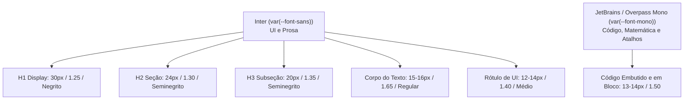

### Escala Tipográfica

| Token | Tamanho | Altura da Linha | Peso | Tracking | Contexto de Uso |
| :--- | :--- | :--- | :--- | :--- | :--- |
| `text-xxs` | 10px (`0.625rem`) | 14px (`0.875rem`) | 500 (Médio) | `0` | Pílulas de atalho (`⌘K`), micro badges de contagem, rótulos de nós |
| `text-xs` | 12px (`0.750rem`) | 16px (`1.000rem`) | 400 / 500 | `0` | Navegação lateral, chaves de propriedade, timestamps |
| `text-sm` | 13px–14px (`0.875rem`) | 20px (`1.250rem`) | 400 / 500 | `0` | Botões padrão, texto do inspetor, células de tabela, campos de formulário |
| `text-base` | 15px–16px (`1.000rem`) | 24px–26px (`1.625rem`) | 400 (Regular) | `0` | Prosa principal de leitura, parágrafos do editor de blocos |
| `text-lg` | 18px (`1.125rem`) | 28px (`1.750rem`) | 500 / 600 | `-0.01em` | Cabeçalhos de callout, subtítulos, títulos de seções |
| `text-xl` | 20px (`1.250rem`) | 28px (`1.750rem`) | 600 (Seminegrito) | `-0.015em` | Cabeçalhos H3 de documento, títulos de diálogos modais |
| `text-2xl` | 24px (`1.500rem`) | 32px (`2.000rem`) | 600 (Seminegrito) | `-0.02em` | Cabeçalhos H2 de documento, títulos de coleções de objetos |
| `text-3xl` | 30px (`1.875rem`) | 38px (`2.375rem`) | 700 (Negrito) | `-0.025em` | Título H1 principal do documento, cabeçalho de espaço |

### Ergonomia de Leitura

- **Comprimento Ideal da Linha**: Limitado entre `65` e `75` caracteres por linha (`max-w-3xl` / `680px`–`760px`).
- **Espaçamento entre Letras**: `letter-spacing: 0` padrão para o corpo de texto para preservar as métricas nativas da fonte.

---

## 5. Métricas Espaciais, Raio de Borda, Sombras de Sussurro & Vidro

### Métricas de Altura Padrão para Controles

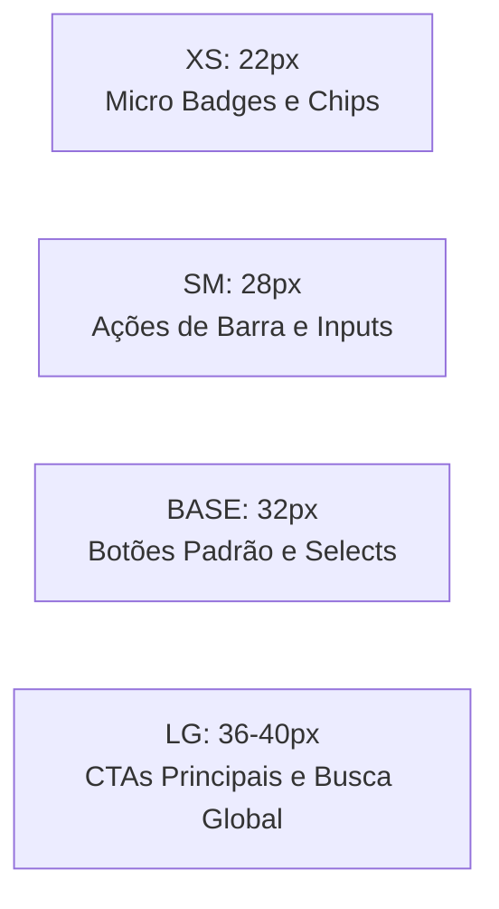

| Tamanho do Controle | Altura | Preenchimento Horizontal | Tamanho do Ícone | Token de Fonte | Caso de Uso |
| :--- | :--- | :--- | :--- | :--- | :--- |
| `xs` | 22px (`1.375rem`) | 6px (`0.375rem`) | 12px | `text-xxs` | Badges de propriedade inline, pílulas de tag, chips |
| `sm` | 28px (`1.750rem`) | 8px (`0.500rem`) | 14px | `text-xs` | Botões de ícone de barra de ferramentas, seletores de visão |
| `base` | 32px (`2.000rem`) | 12px (`0.750rem`) | 16px | `text-sm` | Botões de formulário principal, campos padrão, menus dropdown |
| `lg` | 36px–40px (`2.250rem`) | 16px (`1.000rem`) | 18px | `text-base` | Botões de ação em destaque, busca global (`⌘K`), botão de adição rápida |

### Progressão de Raio de Borda

| Token de Raio | Valor | Componentes Aplicados |
| :--- | :--- | :--- |
| `rounded-xs` | 4px (`0.25rem`) | Tooltips, pontos de status micro, trechos de código embutidos |
| `rounded-sm` | 6px (`0.375rem`) | Chips de rótulo de propriedade, pílulas de tag, pequenos itens de menu |
| `rounded-md` | 8px (`0.500rem`) | Botões padrão, campos de entrada, menus de contexto, popovers |
| `rounded-lg` / `radius` | 10px–12px (`0.625rem`–`0.75rem`) | Tela de espaço emoldurada, cartões, diálogos modais, painéis inspetores |
| `rounded-full` | 9999px | Avatares, barras de ação flutuantes em formato de pílula, status |

### Sombras de Sussurro (*Whisper Shadows*) & Glassmorfismo

```css
/* Sombra de Sussurro Ambiente (Cartões, Popovers) */
.shadow-whisper {
  box-shadow: 
    0 1px 2px 0 oklch(0 0 0 / 4%),
    0 2px 6px 1px oklch(0 0 0 / 2%);
}

/* Sombra de Sussurro Elevada (Modals, Paleta de Comandos Flutuante) */
.shadow-whisper-elevated {
  box-shadow: 
    0 12px 32px -4px oklch(0 0 0 / 8%),
    0 4px 12px -2px oklch(0 0 0 / 4%);
}

/* Superfície Glassmórfica (Cabeçalhos Fixos, Barras Flutuantes) */
.surface-glass {
  background-color: color-mix(in oklch, var(--bg-base) 80%, transparent);
  backdrop-filter: blur(12px) saturate(180%);
  -webkit-backdrop-filter: blur(12px) saturate(180%);
  border: 1px solid var(--border-subtle);
}
```

---

## 6. Geometria do Shell do Espaço em 3 Painéis

O shell do espaço opera em uma **Arquitetura Rígida de Tela Emoldurada em Três Painéis**, isolando a navegação, a edição e a inspeção relacional em zonas espaciais previsíveis.

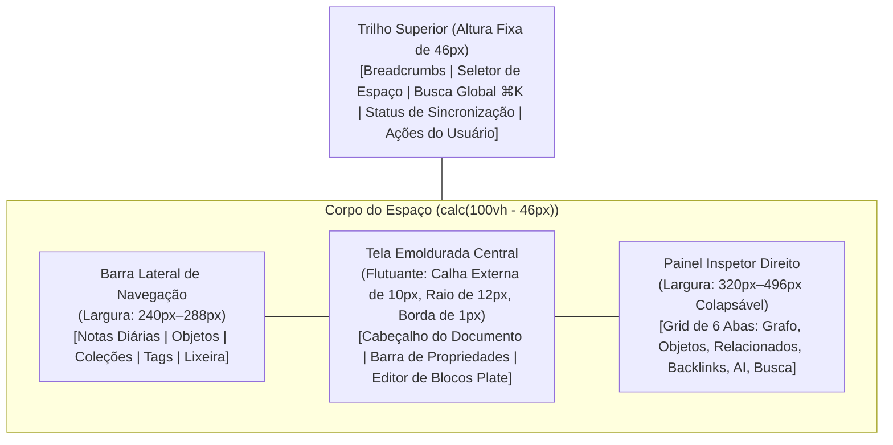

### Métricas do Grid Espacial

1. **Trilho Superior (Fixa em 46px)**: Cabeçalho global persistente com seletor de espaço, caminho de breadcrumb, botão de busca rápida (`⌘K`), indicador de sincronização e perfil de usuário.
2. **Barra Lateral Esquerda (240px–288px)**: Coluna de navegação colapsável com limites redimensionáveis, calendário de notas diárias fixado, diretório de tipos de objetos e visões de coleções personalizadas.
3. **Tela Emoldurada Central**:
   - Contêiner emoldurado flutuante elevado sobre `--bg-back` com uma **calha externa de 10px**.
   - Raio de borda: **12px** (`rounded-xl`).
   - Borda fina: `1px solid var(--border-base)`.
   - Rolagem vertical independente (`overflow-y: auto`) com zero variação horizontal.
   - Coluna de prosa de leitura centralizada em `max-w-3xl` (760px).
4. **Painel Inspetor Direito (320px–496px)**: Gaveta de contexto multi-aba que fornece acesso instantâneo às relações do grafo e metadados:
   - **Aba 1: Grafo** — Visualização interativa local de nós em D3/WebGL centralizada na entidade ativa.
   - **Aba 2: Objetos** — Referências a entidades filhas e objetos estruturados embutidos.
   - **Aba 3: Relacionados** — Relações explícitas e tipadas do grafo (`sourceId` $\rightarrow$ `targetId`).
   - **Aba 4: Backlinks** — Referências recíprocas de entrada e menções não vinculadas de palavras-chave.
   - **Aba 5: AI Chat** — Assistente conversacional embasado no contexto da nota ativa.
   - **Aba 6: Busca / Propriedades** — Inspetor de esquema de propriedades dinâmico e filtros de busca facetada.

### Breakpoints Responsivos e Layouts Adaptativos

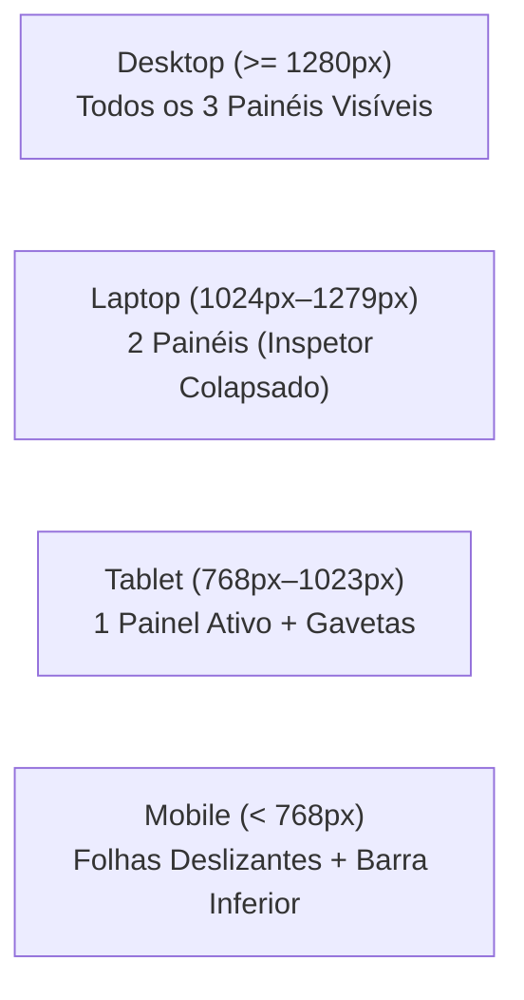

- **Desktop (`>= 1280px`)**: Layout simultâneo completo de três painéis. A barra lateral esquerda e o inspetor direito permanecem fixados.
- **Laptop / Médio (`1024px – 1279px`)**: Layout principal de dois painéis. O inspetor direito fica colapsado por padrão, abrindo como gaveta sobreposta sob demanda.
- **Tablet (`768px – 1023px`)**: Tela central ativa única. A barra lateral esquerda abre como gaveta modal; o inspetor direito opera como painel sobreposto.
- **Mobile (`< 768px`)**: Tela única em modo tela cheia. A barra de navegação inferior substitui a barra superior; barra lateral e inspetor convertem-se em folhas deslizantes inferiores com suporte ao evento `visualViewport` para evitar recortes pelo teclado virtual (`padding-bottom: env(safe-area-inset-bottom)`).

---

## 7. Arquitetura Baseada em Objetos & Modelos de Entidade

Diferente de aplicações de notas tradicionais vinculadas a pastas rígidas, todos os itens são modelados como objetos semânticos tipados de primeira classe dentro de **Espaços** multi-tenant particionados.

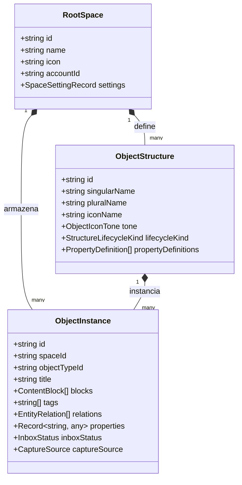

### Entidades Centrais do Domínio

1. **Notas Diárias (`type: "daily_note"`)**: Entradas de diário ancoradas ao tempo que unem eventos de calendário externos, tarefas consolidadas (agendadas, concluídas, transferidas) e métricas diárias.
2. **Tarefas (`type: "task"`)**: Itens acionáveis estilo GTD com status de ciclo de vida (`todo`, `in_progress`, `done`, `cancelled`), intervalos de data de vencimento, níveis de prioridade (`low`, `medium`, `high`, `urgent`) e relações com tarefas pai/subtarefas.
3. **Ativos Multimídia (`type: "image" | "audio" | "pdf" | "file"`)**: Arquivos binários armazenados na tabela `media` com texto extraído via OCR, transcrições de áudio Whisper com picos de forma de onda e árvore de índice de PDFs.
4. **Destaques & Citações (`type: "highlight"`)**: Excertos literais ancorados a arquivos fonte ou artigos da web com códigos de cor, seletores DOM e coordenadas de página.
5. **Flashcards (`type: "flashcard"`)**: Cartões de estudo para repetição espaçada embasados em citações originais, agendados pelo motor matemático **FSRS** (*Free Spaced Repetition Scheduler*) (`stability`, `difficulty`, `interval`, `lapses`).
6. **Metas de Estudo (`type: "study_goal"`)**: Painéis de ritmo que calculam cotas diárias de cartões e marcos de conclusão para exames.

---

## 8. Visões de Objetos & Layouts de Dados

As entidades podem ser embutidas em documentos ou exibidas em visões de coleção por meio de **6 Modos de Apresentação de Objeto** e **4 Layouts de Visão de Dados**.

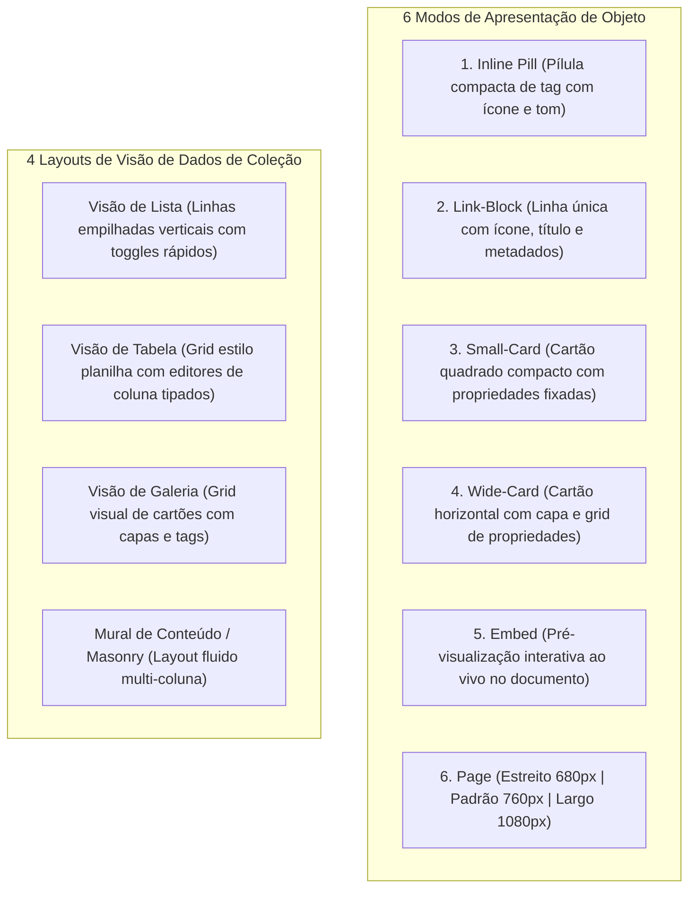

### Apresentações de Objeto Embutido

1. **Pílula Inline (Inline Pill)**: Chip compacto contendo ícone do objeto, tom de fundo, título e gatilho de hovercard interativo.
2. **Bloco de Link (Link-Block)**: Bloco de chamada de largura total com ícone inicial, título, resumo e badge de relação rápida.
3. **Cartão Pequeno (Small-Card)**: Cartão de grid compacto destacando o ícone, título e até 3 propriedades fixadas (`smallCardVisiblePropertyIds`).
4. **Cartão Largo (Wide-Card)**: Cartão em destaque com imagem de capa na parte superior/esquerda, badge de tipo, título, grid completo de propriedades e contador de backlinks.
5. **Embutido (Embed)**: Sub-visão interativa que permite leitura completa e edição de blocos dentro de documentos pai.
6. **Visão de Página (Page View)**: Espaço de objeto em tela cheia com suporte a três larguras de layout:
   - **Estreito**: Coluna de leitura centralizada de 680px.
   - **Padrão**: Coluna editorial equilibrada de 760px.
   - **Largo**: Tela fluida de 1080px para tabelas largas, consultas de dados e visões de quadro.

### Layouts de Visão de Dados para Coleções

1. **Visão de Lista**: Lista vertical limpa e otimizada para leitura rápida, seleção em lote e alteração direta de status.
2. **Visão de Tabela**: Grid de planilha de alta densidade com reordenação de colunas por arrastar e soltar, larguras ajustáveis, renderizadores de célula tipados, ordenação e filtros múltiplos.
3. **Visão de Galeria**: Grid visual que renderiza capas proporcionais, badges de objeto e chips de tag.
4. **Mural de Conteúdo / Masonry**: Layout adaptativo em colunas que distribui os cartões pela altura do conteúdo para maximizar a utilização da tela sem lacunas verticais.

---

## 9. Editor de Blocos & Componentes de Conteúdo

A camada de edição de texto rico em blocos é construída sobre a estrutura **Plate** (`platejs` v53 com fundação Slate), utilizando componentes de código aberto mantidos localmente na pasta do projeto.

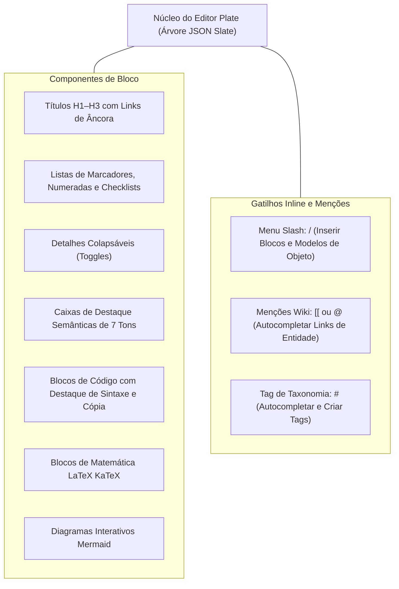

### Tipos de Destaque Semântico (7 Variantes)

| Tipo de Callout | Token de Tom | Ícone | Significado Funcional |
| :--- | :--- | :--- | :--- |
| **Info** | Blue | `Info` | Notas informativas neutras, contexto de fundo |
| **Nota** | Slate / Neutral | `FileText` | Anotações gerais, comentários do autor |
| **Sucesso** | Emerald / Green | `CheckCircle2` | Validações bem-sucedidas, fatos verificados, metas concluídas |
| **Aviso** | Amber | `AlertTriangle` | Alertas de precaução, armadilhas potenciais |
| **Perigo / Erro**| Red | `AlertOctagon` | Erros críticos, ações destrutivas, hipóteses invalidadas |
| **Dica / Ideia** | Lime / Yellow | `Lightbulb` | Dicas acionáveis, ideias criativas |
| **Citação** | Rose / Violet | `Quote` | Citações diretas, referências literárias |

---

## 10. Contrato de Animações e Tempo de Interface Flutuante

Para garantir uma navegação previsível e sem fadiga visual, todos os elementos flutuantes de interface seguem **contratos estritos de tempo de interação**.

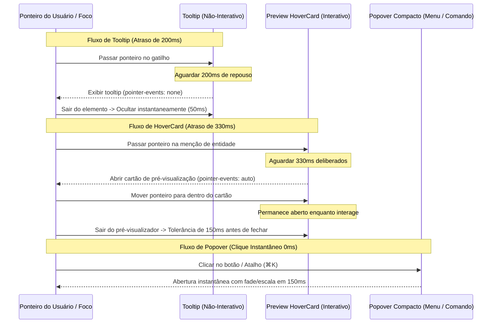

### Especificação de Tempo de Interação

| Tipo de UI Flutuante | Atraso para Exibir | Atraso para Ocultar | Eventos de Ponteiro | Transformação de Animação | Caso de Uso |
| :--- | :--- | :--- | :--- | :--- | :--- |
| **Tooltip** | 200ms | 50ms | `none` | Fade in (100ms) | Descrição de botões com ícone, atalhos de teclado |
| **Preview HoverCard**| 330ms | 150ms de tolerância | `auto` | Fade e escala (`scale(0.98)` $\rightarrow$ `1.0`) | Links wiki de entidade, chips de menção |
| **Popover Compacto** | 0ms (clique) | 0ms (clique fora/Esc) | `auto` | Suavização spring (150ms) | Comandos slash, menus dropdown, seletores de cor |
| **Paleta de Comandos (`⌘K`)** | 0ms (atalho) | 0ms | `auto` | Fade e deslizamento (120ms) | Busca global, execução de comandos, troca rápida |

---

## 11. Protocolos de Interação com Agentes de IA

O espaço integra um assistente de IA consciente da privacidade e embasado no contexto, que opera sob limites estritos de aprovação do usuário.

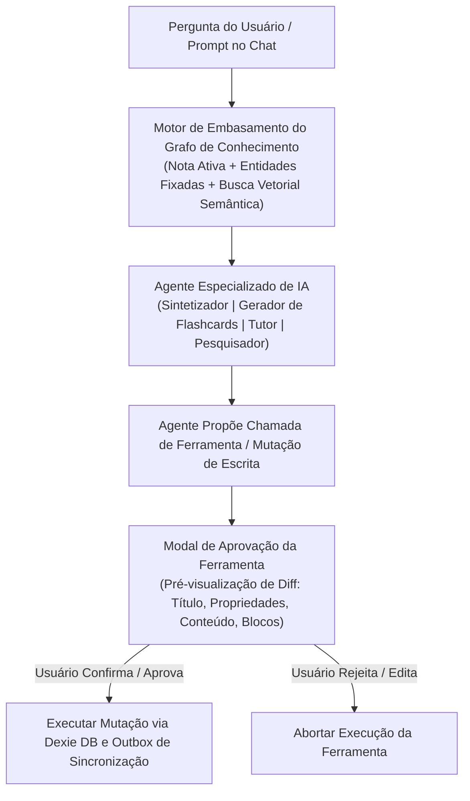

### Arquétipos de Agente de IA

1. **Sintetizador de Conhecimento**: Gera resumos entre documentos, extrai tags temáticas e descobre clusters emergentes de entidades entre espaços.
2. **Gerador de Flashcards (FSRS)**: Analisa textos de estudo destacando perguntas e respostas no formato Q&A e cloze embasados nos excertos de origem.
3. **Tutor Socrático**: Conduz diálogos de recall ativo embasados estritamente nas notas verificadas do usuário e livros didáticos ingeridos.
4. **Assistente de Pesquisa**: Formata bibliografias estruturadas, resumos de recortes da web e tabelas comparativas de literatura.

### Aprovação de Ferramentas & Segurança de Mutações

- **Zero Mutações Silenciosas**: A IA não pode modificar notas do usuário, criar registros ou deletar itens silenciosamente.
- **Modal de Aprovação de Ferramenta**: Antes de executar qualquer ferramenta de escrita (ex: `create_entity`, `update_properties`, `delete_relation`), um cartão de pré-visualização de diff é apresentado exibindo:
  - Modificações exatas de propriedades (antes vs. depois).
  - Título da entidade alvo, espaço e badge de ícone.
  - Aprovação com um clique em **Aprovar** (`Enter`) ou **Rejeitar** (`Esc`).
- **Protocolos BYOK & MCP Local**:
  - Suporte completo para uso de chave própria de API (**BYOK**) com armazenamento criptografado no cliente.
  - Integração nativa com servidores de ferramentas do Protocolo de Contexto de Modelo (**MCP**) para acesso a arquivos e ferramentas locais.

---

## 12. Verificação e Referências Cruzadas de Arquitetura

### Padrões de Verificação

1. **Invariantes de Tipagem em TypeScript**: Todos os modelos de entidade, tipos de propriedades e definições de tom devem compilar com zero erros (`pnpm typecheck`).
2. **Linter e Formatador Biome**: Formatação limpa e zero violações de lint em toda a documentação, histórias e componentes (`pnpm check`).
3. **Bancada de Histórias no Ladle**: Cada token de design, tamanho de botão, variante de callout e bloco do editor é visualmente verificável nas histórias do Ladle em `src/components/ladle/` e `docs/design/design.stories.tsx`.

### Documentos de Arquitetura Relacionados

- [Especificação de Arquitetura Principal](../architecture/README.md)
- [Especificação da Arquitetura de Conhecimento e Entidades do Domínio](../architecture/entities.md)
- [Especificação do Particionamento de Espaços Multi-Tenant](../architecture/spaces.md)
- [Especificação da Arquitetura de Roteamento e Layouts](../architecture/routing.md)
- [Síntese Histórica de Referência (Worktrees & Capacities)](../architecture/HISTORICAL_REFERENCE_SYNTHESIS.md)
- [Índice de Registros de Decisões de Arquitetura (MADR)](../../../../DECISIONS.md)
- [ADR-0008: Migração para a Estrutura do Editor de Texto Rico Plate](../decisions/0008-plate-rich-text-editor-framework-migration.md)
- [Raiz da Especificação do Design System](../../../../DESIGN.md)
