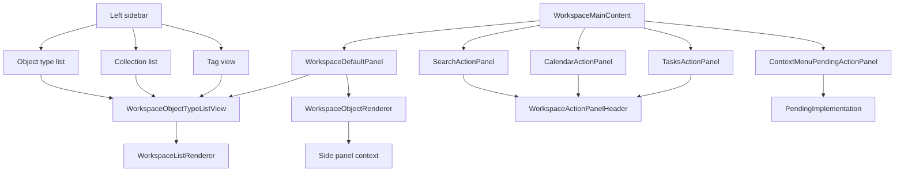

# WorkspaceMainContent Architecture

`WorkspaceMainContent` is easiest to understand through the Capacities content model: an object is the basic unit, every object has one object type, and opening an object type shows the list/database of objects of that type. Collections are manual sub-groups inside one object type. Tags cut across object types.

## Simple Route

Object type list means “show all objects of this type”. Collection list means “show a manual subset inside one object type”. Tag view means “show related objects across object types”.

## Component Boundary

`WorkspaceMainContent` decides what the main panel shows. Normal browsing goes to `WorkspaceDefaultPanel`, which chooses either `WorkspaceObjectTypeListView` for list-like tabs or `WorkspaceObjectRenderer` for one opened object. Search, Calendar, Tasks, and pending context-menu actions are temporary action surfaces, not the core content model. Explore stays in the side panel like Capacities.

## Component Responsibilities

`WorkspaceMainContent` is the top-level router for the center pane. It reads `activeAction` from `WorkspaceProvider`, remembers the previous normal `mainValue`, handles Escape to return from temporary action surfaces, and chooses between the normal workspace route and temporary panels.

`WorkspaceDefaultPanel` is the normal browsing surface. It resolves the active `mainValue` against real Dexie-backed entities and object type records, then opens either a single object view or an object type list view. Unknown or not-yet-implemented routes fall back to `PendingImplementation`.

`WorkspaceActionPanelHeader` is the shared header used by temporary panels. It provides the panel label, title, return button, and Escape affordance so Search, Calendar, Tasks, and pending actions behave consistently.

`SearchActionPanel` is the in-workspace entity search surface. It filters `createdEntities` by title, object type id, or entity id; supports arrow/Enter keyboard selection; opens results as main tabs; and uses object type tone metadata for tab icon styling.

`CalendarActionPanel` is the date navigation placeholder surface. It wraps the shared `Calendar` component, tracks the selected date locally, and keeps the panel isolated from persistence until the calendar workflow is connected to real daily-note or scheduling data.

`TasksActionPanel` filters workspace entities down to the `task` object type. It supports keyboard navigation, opens selected tasks in the main tab set, and can create the first task through the repository-backed `createWorkspaceEntity` path.

`ContextMenuPendingActionPanel` renders a focused placeholder for context menu actions that have routing but no finished workflow yet. It maps action ids through `getContextMenuPendingDetails` and delegates the visual empty state to `PendingImplementation`.

`WorkspaceObjectRenderer` renders one opened object entity. It owns the single-object presentation path and receives both the entity record and its object type metadata from `WorkspaceDefaultPanel`.

`WorkspaceObjectTypeListView` renders list/database-style tabs for an object type. It receives the full entity collection, the active object type descriptor, and callbacks for creating or opening entities.

`WorkspaceListRenderer` is the reusable list surface under `WorkspaceObjectTypeListView`. It groups and sorts the object type's entities for display, keeps empty-list behavior consistent, and centralizes create/open callbacks so list tabs share one rendering path.

`PendingImplementation` is the intentional fallback for valid routes or actions whose final UI is not built yet. In this file it prevents blank center panes while preserving a clear implementation target.

## State Ownership

`WorkspaceProvider` owns `activeAction`, `mainValue`, `activeEntityId`, `mainTabs`, object types, collections, tags, and created entities. `WorkspaceMainContent` should stay a router between state and content surfaces.
