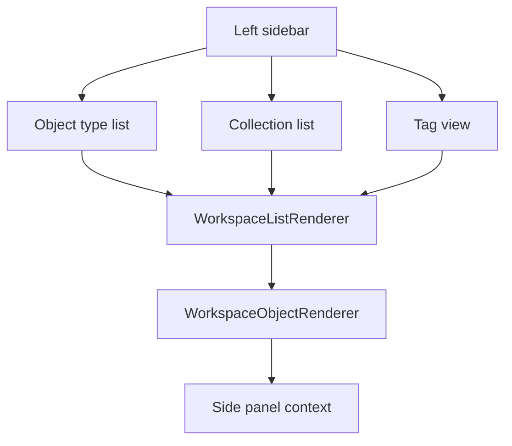

# WorkspaceMainContent Architecture

`WorkspaceMainContent` is easiest to understand through the Capacities content model: an object is the basic unit, every object has one object type, and opening an object type shows the list/database of objects of that type. Collections are manual sub-groups inside one object type. Tags cut across object types.

## Simple Route

Object type list means “show all objects of this type”. Collection list means “show a manual subset inside one object type”. Tag view means “show related objects across object types”.

## Component Boundary

`WorkspaceMainContent` decides what the main panel shows. Normal browsing goes to `WorkspaceDefaultPanel`, which chooses either `WorkspaceListRenderer` for list-like tabs or `WorkspaceObjectRenderer` for one opened object. Search, Calendar, Explore, Tasks, and pending context-menu actions are temporary action surfaces, not the core content model.

## State Ownership

`WorkspaceProvider` owns `activeAction`, `mainValue`, `activeEntityId`, `mainTabs`, object types, collections, tags, and created entities. `WorkspaceMainContent` should stay a router between state and content surfaces.
