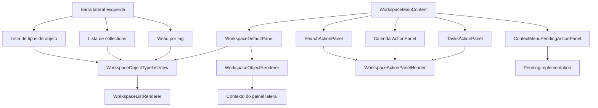

# Arquitetura do WorkspaceMainContent

`WorkspaceMainContent` fica mais fácil de entender pelo modelo de conteúdo do Capacities: um objeto é a unidade básica, cada objeto tem um tipo, e abrir um tipo mostra a lista ou banco de objetos daquele tipo. Collections são subgrupos manuais dentro de um único tipo de objeto. Tags cruzam vários tipos de objeto.

## Rota Simples

Lista de tipo de objeto significa "mostrar todos os objetos deste tipo". Lista de collection significa "mostrar um subconjunto manual dentro de um tipo de objeto". Visão por tag significa "mostrar objetos relacionados atravessando tipos de objeto".

## Limite dos Componentes

`WorkspaceMainContent` decide o que o painel central mostra. A navegação normal vai para `WorkspaceDefaultPanel`, que escolhe entre `WorkspaceObjectTypeListView` para abas de lista ou `WorkspaceObjectRenderer` para um objeto aberto. Search, Calendar, Tasks e ações pendentes de menu de contexto são superfícies temporárias de ação, não o modelo central de conteúdo. Explore permanece no painel lateral como no Capacities.

## Responsabilidades dos Componentes

`WorkspaceMainContent` é o roteador principal do painel central. Ele lê `activeAction` de `WorkspaceProvider`, lembra o `mainValue` normal anterior, trata Escape para sair de superfícies temporárias e escolhe entre a rota normal do workspace e os painéis temporários.

`WorkspaceDefaultPanel` é a superfície normal de navegação. Ele resolve o `mainValue` ativo contra entidades reais do Dexie e registros de tipo de objeto, depois abre uma visão de objeto único ou uma lista de tipo de objeto. Rotas desconhecidas ou ainda não implementadas caem em `PendingImplementation`.

`WorkspaceActionPanelHeader` é o cabeçalho compartilhado dos painéis temporários. Ele fornece label, título, botão de retorno e dica de Escape para que Search, Calendar, Tasks e ações pendentes se comportem de forma consistente.

`SearchActionPanel` é a busca de entidades dentro do workspace. Ele filtra `createdEntities` por título, id do tipo de objeto ou id da entidade; suporta seleção por setas/Enter; abre resultados como abas principais; e usa os tons dos tipos de objeto para estilizar os ícones das abas.

`CalendarActionPanel` é a superfície temporária de navegação por data. Ele envolve o componente compartilhado `Calendar`, controla a data selecionada localmente e mantém o painel isolado de persistência até o fluxo de notas diárias ou agenda ser conectado a dados reais.

`TasksActionPanel` filtra as entidades do workspace para o tipo `task`. Ele suporta navegação por teclado, abre tarefas selecionadas no conjunto de abas principais e pode criar a primeira tarefa pelo caminho persistido de `createWorkspaceEntity`.

`ContextMenuPendingActionPanel` renderiza um placeholder focado para ações de menu de contexto que já têm roteamento, mas ainda não têm fluxo finalizado. Ele mapeia ids de ação por `getContextMenuPendingDetails` e delega o estado vazio visual para `PendingImplementation`.

`WorkspaceObjectRenderer` renderiza uma entidade aberta. Ele é responsável pela apresentação de objeto único e recebe tanto o registro da entidade quanto os metadados do tipo de objeto a partir de `WorkspaceDefaultPanel`.

`WorkspaceObjectTypeListView` renderiza abas de lista ou banco para um tipo de objeto. Ele recebe a coleção completa de entidades, o descritor ativo do tipo de objeto e callbacks para criar ou abrir entidades.

`WorkspaceListRenderer` é a superfície reutilizável de lista abaixo de `WorkspaceObjectTypeListView`. Ele agrupa e ordena as entidades daquele tipo para exibição, mantém o comportamento de lista vazia consistente e centraliza callbacks de criar/abrir para que abas de lista compartilhem um único caminho de renderização.

`PendingImplementation` é o fallback intencional para rotas ou ações válidas cuja UI final ainda não foi construída. Neste arquivo ele evita painéis centrais em branco enquanto preserva um alvo claro de implementação.

## Dono do Estado

`WorkspaceProvider` é dono de `activeAction`, `mainValue`, `activeEntityId`, `mainTabs`, tipos de objeto, collections, tags e entidades criadas. `WorkspaceMainContent` deve continuar sendo um roteador entre estado e superfícies de conteúdo.
