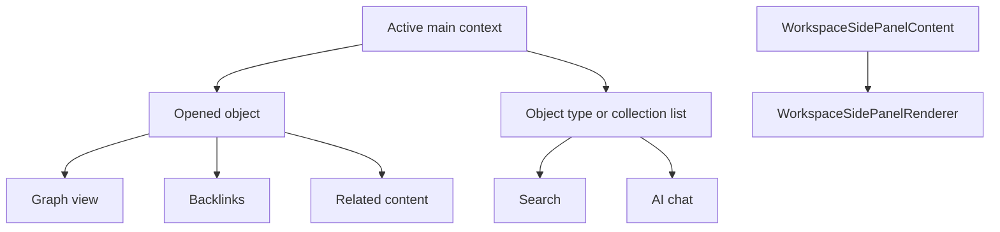

# WorkspaceSidePanelContent Architecture

`WorkspaceSidePanelContent` is the right panel body. It does not own content; it reads the active main context and shows the side view that makes sense for that context.

## Current Boundary

The side panel has real tab/context behavior, but most bodies still intentionally render a named `PendingImplementation` until Graph view, backlinks, related content, AI chat, and local search are implemented.

## Simple Rule

If the main panel is one object, the side panel can show object-specific context. If the main panel is a list, the side panel should stay list-scoped and expose only list-safe tools.
