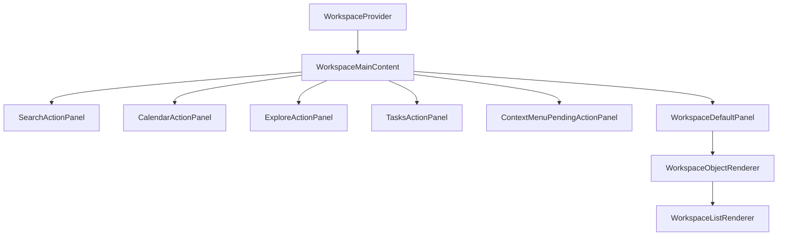

# WorkspaceMainContent Architecture

`WorkspaceMainContent` is the main workspace body. It reads transient workspace state from `WorkspaceProvider`, routes primary actions to dedicated action panels, and falls back to `WorkspaceDefaultPanel` for normal tab/object rendering.

## State Ownership

`WorkspaceProvider` owns `activeAction`, `mainValue`, `activeEntityId`, `mainTabs`, object types, and created entities. `WorkspaceMainContent` only decides which content surface should be visible for that state.
