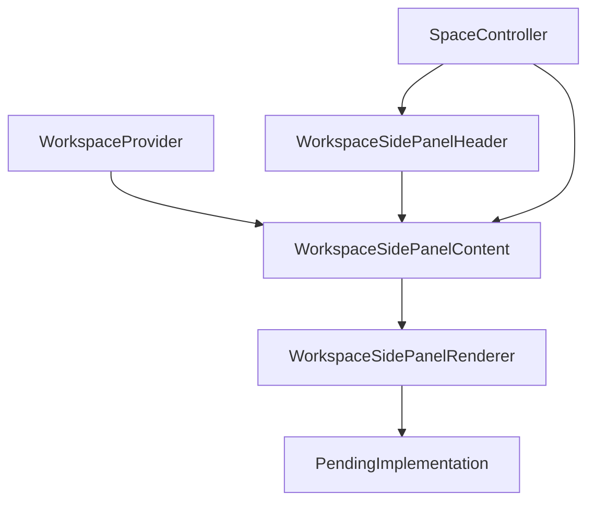

# WorkspaceSidePanelContent Architecture

`WorkspaceSidePanelContent` is the right panel body. It reads the current side tab and active main object from `WorkspaceProvider`, then delegates the actual panel surface to `WorkspaceSidePanelRenderer`.

## Current Boundary

The side panel has real tab/context behavior, but most panel bodies still intentionally render a named `PendingImplementation` until Graph view, backlinks, related content, AI chat, and local search are implemented.
